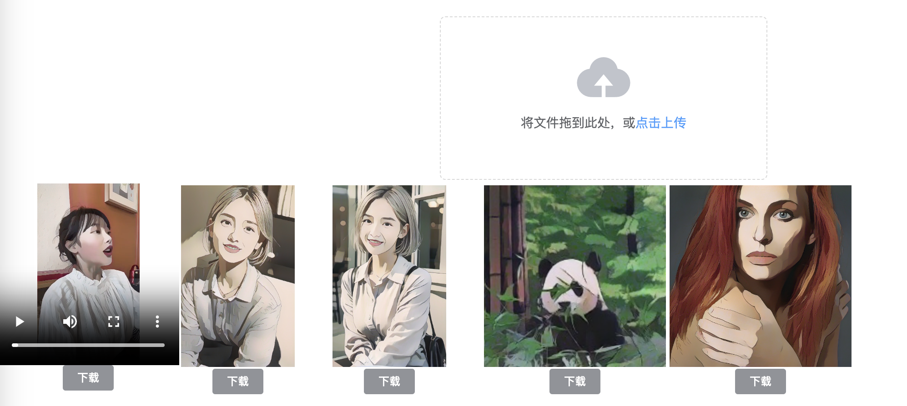

# Media2Cartoon

[**English**](./README.md) | [**中文简体**](./README_CN.md)

可以将上传的图片或视频转换成卡通风格。



## 功能特点

+ 支持图片和视频格式的上传
+ 支持重新定义视频大小
+ 支持截取视频长度

## 安装步骤

### Docker方式（强烈推荐）

1. 克隆代码库到本地

```
git clone https://github.com/jessdy/Media2Cartoon.git
```


2. 容器构建

```sh
docker build -t Media2Cartoon:1.0 .
```


3. 启动容器

```sh
docker run -d --name cartoon-1.0 -p 18080:18080 Media2Cartoon:1.0
```


4. 访问

- 打开：http://localhost:18080/front/

###  本地方式
1. 克隆代码库到本地

```
git clone https://github.com/jessdy/Media2Cartoon.git
```

2. 依赖安装

```cmd
cd server
pip uninstall -y protobuf
pip install protobuf==3.19.0 -i https://pypi.douban.com/simple      
pip install -r requirements.txt -i https://pypi.douban.com/simple 
uvicorn main:app --reload --port 18080 --host 0.0.0.0

```

3. 访问

- 打开：http://localhost:18080/front/